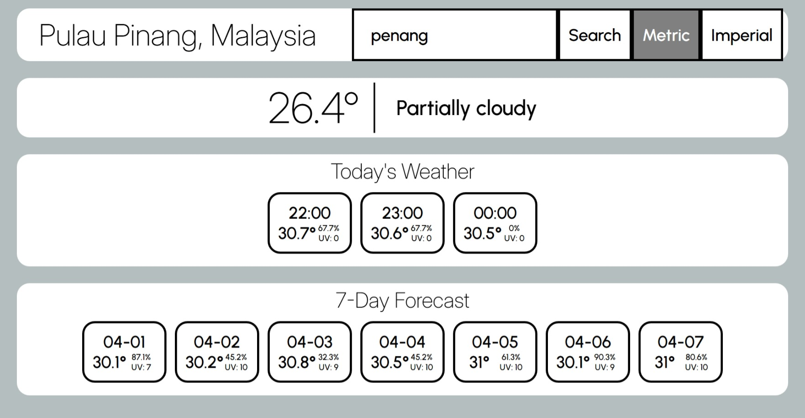
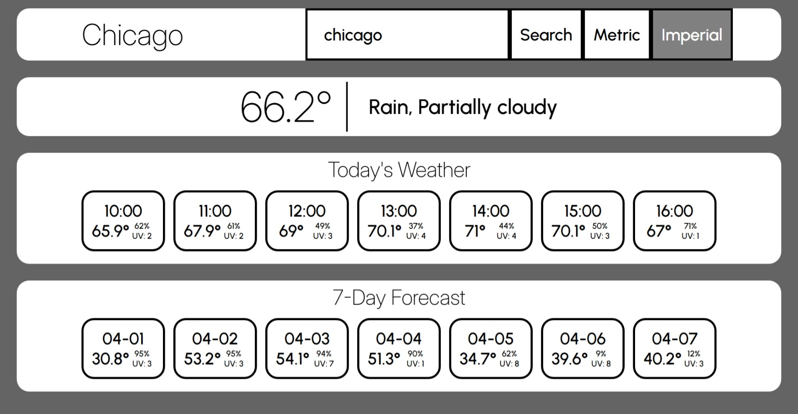
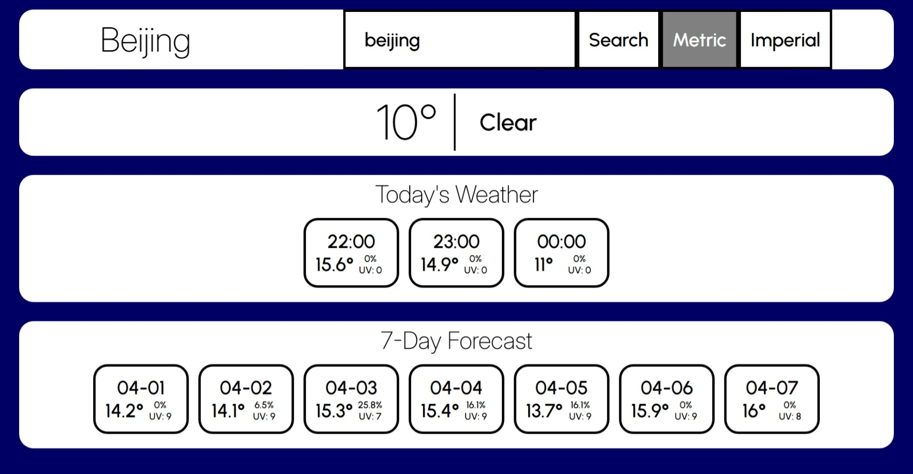
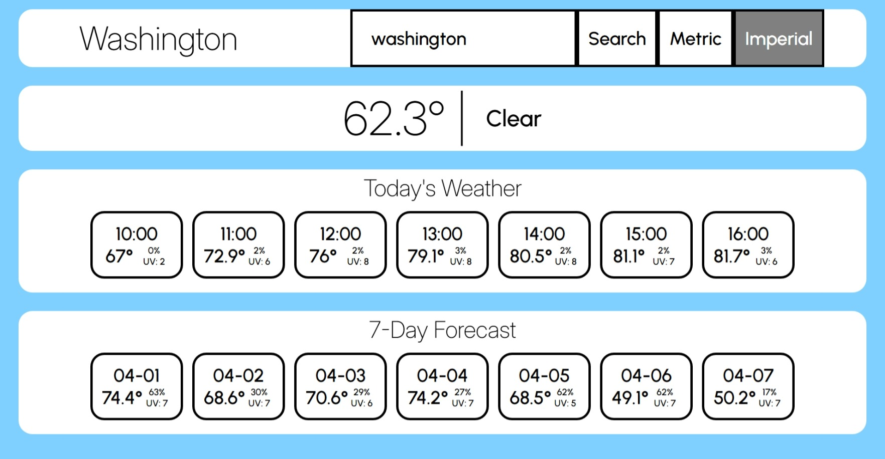

# weather-app

weather app project based on The Odin Project curriculum.

Live demo link: https://j0e-quan.github.io/weather-app/

## Technologies used:

- HTML for basic page layout
- CSS for styling page elements and use of web fonts (Inter and Urbanist)
- Flexbox and Grid for arranging page elements and improving responsiveness
- JavaScript for site logic and rendering weather data
- npm and webpack for managing and bundling code modules
- Git for version control

## Key features:

- Uses Visual Crossing API to provide accurate weather data
- Background changes depending on current weather conditions
- Hourly and 7-day forecasts are provided
- Loading screen is shown until data is fetched
- Error alerts provide info on incorrect inputs

## Credits:

- loading GIF was taken from [GIPHY](https://giphy.com/gifs/juan-gabriel-sSgvbe1m3n93G)

## Gallery:

## Getting started:

1. clone this repo in your desired folder: `git clone https://github.com/J0e-Quan/weather-app.git`
2. `npm install` to install any required dependencies
3. `npm run dev` to activate the dev server (View the project by navigating to the localhost address shown in your terminal.)
4. `npm run build` will bundle the code into the 'dist' folder
